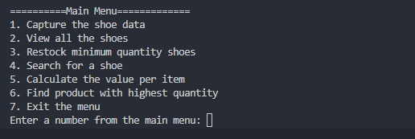

# Inventory Management System.

A Project that uses OOP in python to manage shoe data, In our constructor we initialize 5 attributes that help us create our shoe object, namely: `country`, `code`, `product`,`cost` and `quantity.
In this project we define methods that help us to determine the cost, quantity and string method.
We also define a few functions in order to obtain shoe-data:

- `read_shoe_data()`: This function uses exception handling to open a file and read the contents of the `inventory.txt` file. When the text file is present, the code in this function proceeds to extract the neccessary data; otherwise it throws a `FileNotFoundError`.

- `Capture_Shoe()`: This function allows us to capture new shoe that was not on the `inventory.txt` file.

- ` view_all()`: Views all the shoes we have on the shoe list including the recent added shoe.

- `restock()`: In this function we request user input whether they want to restock the lowest quantity shoe or not, if they want to request then we prompt them for the quantity they want to add and  update `inventory.txt` with the new quantity.

- `search_shoe()`: This function prompts user for input which is thwe code then if the code they provided is valid the requested shoe details are presented else an error message is presented.

- `value_per_item`: This function determines the shoe value by multiplying the cost and quantity.

- `highest_qty()`: this function basically looks for the highest quantity shoe in the shoe list.

## Installation

This Project requires that we have python installed, any version from 3.11 is acceptable.please follow the instructions below to get a sense of how you may install all necessary dependencies.
```bash
virtualenv venv
```
After this we want to make to ensure that we have python installed,like so:
```bash
pip install python
```

## Usage/Examples

To use this program,navigate to your terminal and type the following command:
```bash
python inventory.py 
```
This will the present the user with a menu, as seen in the screenshot below:


## Contributing
pull requests are welcome. For major changes please open an issue first to discuss what you would like to change. Please make sure to update tests as appropriate.

## License
[MIT](https://choosealicense.com/licenses/mit/)